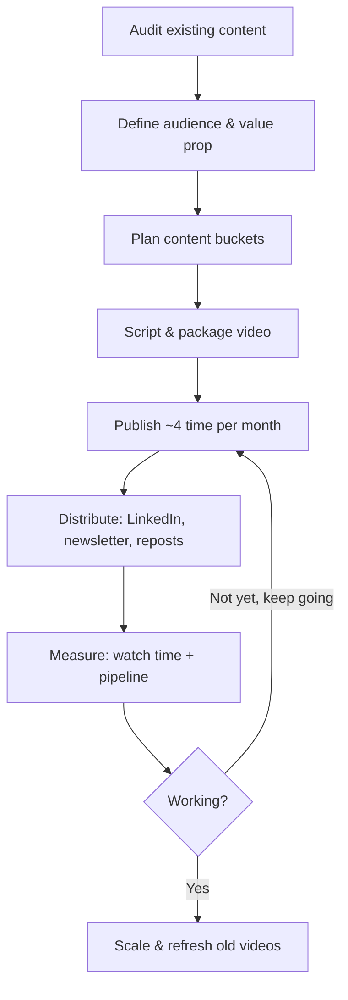

# SOP: B2B SaaS YouTube Content Strategy

**Based on:** 10 expert sources and their YouTube transcripts and LinkedIn posts collected in `Research/Sources`\
**Owner:** Animesh Dolas

Throughout the playbook, recommendations are supported by expert sources. Where experts disagree, their perspectives are compared and evaluated to provide a reasoned recommendation rather than simply summarizing opinions.

---
<details>
<summary> <b> 📑Table of Contents</b> </summary>

1. **[Objective](#1-objective)**
2. **[Scope](#2-scope)**
3. **[Overall Workflow](#3-overall-workflow-continuous-improvement-loop)**
4. **[Standard Operating Procedure](#4-standard-operating-procedure)**
      - [Phase 1: Research & Topic Selection](#phase-1-research--topic-selection)
          - [Step 1: Identify Content-Market Fit](#step-1--identify-content-market-fit)
          - [Step 2: Identify High-Potential Topics](#step-2-identify-high-potential-topics-to-attract-qualified-buyers)
      - [Phase 2: Content Production & Optimization](#phase-2-content-production--optimization)
          - [Step 1: Audit Existing Resource Material](#step-1-audit-existing-resource-material)
          - [Step 2: Produce YouTube-Native Content](#step-2-produce-youtube-native-content)
          - [Step 3: Build Founder Trust](#step-3-build-founder-trust)
          - [Step 4: Video Production Strategy](#step-4-video-production-stratagy)
          - [Step 5: Optimize for Watch Time, Not Views](#step-5-optimize-for-watch-time-not-views)
      - [Phase 3: Distribution & Amplification](#phase-3-distribution--amplification)
          - [Step 1: Maximize Distribution & Repurposing](#step-1-maximize-distribution--repurposing)
      - [Phase 4: Convert Viewers into Pipeline](#phase-4-convert-viewers-into-pipeline)
          - [Step 1: Replace "Book a Demo" with "Watch a Demo"](#step-1--replace-book-a-demo-with-watch-a-demo)
          - [Step 2: Qualify Leads Using Video Engagement](#step-2--qualify-leads-using-video-engagement)
          - [Step 3: Place Mid-Roll Calls to Action](#step-3--place-mid-roll-calls-to-action)
          - [Step 4: Identify Anonymous Visitors](#step-4--identify-anonymous-visitors)
5. **[Where Experts Disagree](#5-where-experts-disagree)**
6. **[What I Rejected and Why](#6-what-i-rejected-and-why)**
7. **[My Original Ideas](#7-my-original-ideas)**
8. **[Weaknesses of This Playbook](#8-weaknesses-of-this-playbook)**
9. **[Experts Whose Advice I Would Apply Selectively](#9-experts-whose-advice-i-would-apply-selectively)**
</details>

---

## Objective
- This playbook is a practical Standard Operating Procedure (SOP) defines a repeatable process for launching, producing and growing YouTube channel as a lead-generation and authority-building channel for a B2B SaaS company.
- Unlike generic YouTube growth guides that optimize for views or subscribers, this playbook focuses on creating content that attracts high-intent buyers, builds long-term trust, and generates qualified sales opportunities

## 2. Scope
This playbook covers:
- Customer research
- Topic validation
- SEO research
- Script planning
- Video production
- YouTube optimization
- LinkedIn distribution
- Influencer collaborations
- Lead generation
- Sales enablement
- Analytics

## 3. Overall Workflow (Continuous Improvement Loop)

---
## 4. Standard Operating Procedure

## Phase 1: Research & Topic Selection
- Identify content opportunities that align customer demand with business objectives and have a high probability of generating qualified pipeline.

### *Step 1 — Identify Content-Market Fit*
- Before investing in production, verify that YouTube is an effective channel for your market.
#### ✅ Checklist
- [ ] **Confirm YouTube appears for buyer-intent searches.**
  - Foundation analyzed **8,000+ B2B SaaS keywords** and found YouTube appearing in:
    - **80%** of product demo searches
    - **22%** of "best [category]" searches
    - **20%** of "[brand] review" searches
    - **20%** of "[brand] v/s [brand]" searches
  - *(Source: Ross Simmonds, LinkedIn Post, June 2026, https://lnkd.in/p/dTzikYru.)*

- [ ] **Validate with independent research.**
  - Deliverable AI-friendly content outline.
  - Because AI search increasingly cites YouTube transcripts when answering detailed technical questions.
  - CASE STUDY 
    - Grizzle analyzed **3,623 videos across 71 SaaS channels** and found YouTube appearing in:
      - **74.9%** of SaaS keywords triggering Google AI Overviews
      - **75.1%** of bottom-of-funnel (BOFU) keywords with AI Overviews
  - *(Source: Tom Whatley, LinkedIn Post, June 2026, https://lnkd.in/p/dKrYANbY.)*
    
- [ ] **Define the Channel's Value Proposition & Audience**
  - Define specifically who the channel is for, what problem it solves, and why anyone should care, independent of the parent brand.
  - **Pick one audience per channel:** retention depends on people returning for a coherent thing.
  - In B2B, the buyer and the recommender are often different people (e.g., IT buys the tool, but a wider set of professionals recommends it) — target broader than "whoever signs the check."
  - Use search-intent research (informational, commercial-investigation, navigational, transactional) plus Reddit and niche-community research to find
  - **"content-market fit":** topics the audience demonstrably already cares about, evidenced by upvotes and engagement.
  - *(Source: Phil Nottingham, YouTube, "How to Build an Audience", 14.07.2023, https://www.youtube.com/watch?v=ZEJVqvQe36w.)*
  - *(Source: Ross Simmonds, YouTube, "Content Growth Framework", 17.03.2023, https://www.youtube.com/watch?v=ZvZxuoLQr9U.)*

- [ ] **Estimate the real addressable audience.**
  - Don't compare B2B performance to consumer YouTube channels.
  - Hundreds of qualified ICP views often outperform thousands of irrelevant views.
  - If your ICP is extremely niche, prioritize videos for sales enablement (sales calls, follow-ups, website, onboarding) instead of relying solely on organic discovery.
  - *(Source: Samu Kovács, LinkedIn Post, June 2026, https://www.linkedin.com/posts/samu-kovacs_how-do-i-know-if-my-ideal-customers-are-activity-7475136870943780864-lO4Y.)*

### *Step 2: Identify High-Potential Topics to attract qualified buyers.*
#### ✅Checklist

- [ ] **Find Proven Content Patterns**
  - Use tools such as **VidIQ**, **10.com**, or similar platforms to identify "outlier" videos that achieved **3–7×** the channel's normal performance.
  - Reverse-engineer the framework (hook, angle, title, structure) instead of copying the topic directly.
  - Adapt the framework to your SaaS niche and ICP.
  - *(Source: Samu Kovács, YouTube, "Watch Me Build a $100M B2B YouTube Strategy in 12 Minutes", 15.06.2026, https://www.youtube.com/watch?v=2tgEvv9Irrc.)*
    
- [ ] **Focus on Urgent & Expensive Problems**
  - Choose topics that solve problems which are:
    - Recurring
    - High-value
    - Time-sensitive
    - Operationally messy
    - Experienced by a clearly defined buyer
  - Avoid creating videos around interesting but low-priority problems.
  - *(Source: TK Kader, YouTube, "The 7 SaaS Ideas I'd Build in 2026 If I Could Start Over", https://www.youtube.com/watch?v=scM150NpNZ4.)*
    
- [ ] **Create Information Gain** 
  - Google increasingly rewards original information rather than duplicated summaries.
  - **🎯 Success Criteria:** Every video contains at least one insight unavailable in competing videos.
  - Before writing the script:
    1. Search the target keyword.
    2. Review the highest-ranking videos and articles.
    3. List what existing content is missing.
    4. Add unique value such as:
    - Original frameworks
    - Customer stories
    - Proprietary data
    - Step-by-step implementation
    - Visual demonstrations
    - Practical examples

Every video should answer the question:
> **"Why should someone watch this instead of the current #1 result?"**\
> *(Source: Tom Whatley, YouTube, "How to Create SEO Content That Ranks, Fast", 23.09.2024, https://www.youtube.com/watch?v=l1b8ok8lr_k.)*

#### Phase 1 Output
- At the end of Phase 1, the team should have:
  - A validated Ideal Customer Profile
  - A prioritized list of customer problems
  - Original content angles
  - Evidence that topics match customer demand
  - Confidence that increased traffic will support business growth rather than amplify positioning issues

## Phase 2: Content Production & Optimization
- Create educational, high-retention YouTube content that builds trust with potential customers and positions the company as an industry authority. 
- Key emphasis is on producing YouTube videos specifically

### *Step 1: Audit existing resource material*
- Inventory existing podcasts, webinars, LinkedIn posts, and newsletters — most companies already hold strong raw material but treat YouTube as storage rather than a channel.
- Based on the audited material use script videos specifically for YouTube with a 10–13 minute target length.
- **CASE STUDY** 
  - Channel built on re-uploads sat at roughly 300 subscribers with negligible organic views; the same material, restructured with YouTube-native titles, hooks, and packaging, produced videos with tens of thousands of views, one past 50,000.
- *(Source: Samu Kovács, YouTube, "Watch Me Build a $100M B2B YouTube Strategy in 12 Minutes", 15.06.2026, https://www.youtube.com/watch?v=2tgEvv9Irrc.)*
  
### *Step 2: Produce YouTube-Native Content*
- Define **one clear objective** for the video. [1]
- Open with the **bottom line** in the first **30 seconds** using a high-contrast hook (e.g., before/after, surprising statistic, or unexpected insight).[2]
- Maintain **high value velocity** by delivering new, non-repetitive information throughout the video. [2]
- Design the **thumbnail before recording** so the video's promise is clear.[3]
- Keep the video focused on **one customer problem**.[4]
- Target **10–15 minutes** when the topic requires depth.[4]
- Remove unnecessary intros, repetition, and filler during editing. [2]
- Place a **soft CTA** (e.g., book a strategy call or start a free trial) around the **50% mark** of the video. [5]

#### Video Blueprint based on experts
| Time | Purpose |
|------|---------|
| **0:00–0:30** | **Hook:** State the expensive problem and immediately demonstrate the outcome or key insight to capture attention. *[1] [5]* |
| **0:30–1:30** | **Roadmap:** Explain what viewers will learn and why it matters. Avoid lengthy brand introductions. *[1]* |
| **1:30–6:00** | **Part 1 – Tactical Value:** Deliver high-density, actionable insights with minimal filler. *[2] [3]* |
| **6:00–7:00** | **Soft CTA:** Introduce a relevant resource, newsletter, template, or self-serve demo that naturally supports the topic. *[6]* |
| **7:00–11:00** | **Part 2 – Implementation:** Walk through the process step by step using examples or case studies to reinforce learning. *[1]* |
| **11:00–End** | **Retention CTA:** Recommend the next relevant YouTube video or playlist to keep viewers within the content ecosystem. *[1] [3]* |

> [!IMPORTANT]
> Important statistics
> - Track click-through rate in YouTube Analytics as the primary thumbnail/title metric: 
>   - Above roughly 5–10% is good, [1]
>   - Above ~10% is very good, [1]
>   - Below ~5% needs work. [2]
> - Do not measure video primarily by view count or classic ROI (direct-attribution revenue). Money-in/money-out ROI does not work as a measurement model for most video content because the customer journey across touchpoints cannot be tracked cleanly; pick a metric that is an honest proxy for value instead [1]
> - Time watched/engaged-view duration is the single most durable long-term metric for brand-building content, because it reflects genuine attention rather than inflated, platform-reported "view" counts [1]

#### Why it matters
YouTube rewards videos that maximize viewer retention, watch time, and engagement. Videos with strong hooks, fast pacing, and continuous value outperform webinar-style recordings with slow introductions and unnecessary filler. [3]\

> **Sources**\
    **[1]** *(Source: Phil Nottingham, YouTube Transcript, "How to Build an Audience", 14.07.2023, https://www.youtube.com/watch?v=ZEJVqvQe36w.)* <br>
    **[2]** *(Source: Samu Kovács, YouTube Transcript, "Watch Me Build a $100M B2B YouTube Strategy in 12 Minutes", 15.06.2026, https://www.youtube.com/watch?v=2tgEvv9Irrc.)*<br>
    **[3]** *(Source: Samu Kovács, YouTube Transcript, "A $7,000,000/yr B2B YouTube Strategy", 22.06.2026, https://www.youtube.com/watch?v=g2YXRjG87pE.)*<br>
    **[4]** *(Source: Tom Whatley, YouTube Transcript, "How to Create SEO Content That Ranks, Fast", 23.09.2024, https://www.youtube.com/watch?v=l1b8ok8lr_k.)*<br>
    **[5]** *(Source: Sam Dunning, YouTube Transcript, "The Best SaaS Marketing Strategies for 2026", 16.06.2026, https://www.youtube.com/watch?v=hD10INBKeqw.)*<br>
    **[6]** *(Source: Tyler Lessard, YouTube, "How to Use Video in B2B Marketing with Tyler Lessard - FINITE B2B Marketing", 02.08.2021, https://www.youtube.com/watch?v=Xuu-_fuKgTI.)*


### *Step 3: Build Founder Trust*
  - Use authentic founder-led content to build to build a "human-to-human" connection that competitors can't easily replicate.
  - People buy from companies they trust. 
  - Authenticity creates a psychological advantage that AI-generated or overly polished corporate content struggles to achieve.
  - *(Source: Phil Nottingham, LinkedIn Post, "Simple Expert-Led Product Videos Build Trust", February 2026, https://lnkd.in/p/gx_emNCf.)*
  
- **🎯 Success criteria**
  - Founder appears on camera
  - Personal experience included
  - Educational focus maintained
- *(Source: Adam Robinson, YouTube, "The ONLY Way to Build a $1M+ SaaS in 2026", 24.03.2026, https://www.youtube.com/watch?v=aaBZ3f5TViQ.)*

### *Step 4: Video production stratagy*
- **Recognize that consistency**, not initial polish, is the binding constraint. Editing, SEO, and packaging are described as "baseline requirements," but most companies quit before YouTube has had time to compound — 12 months of consistency matters more than any single strong video
-  *(Source: Samu Kovács, LinkedIn Post, July 2026, https://lnkd.in/p/gwkv2M-A.)*
- **Batch Recording:** Publish 4 videos per month as the stated "sweet spot" cadence for this founder-led, YouTube-first model.
- *(Source: Samu Kovács, YouTube, "Watch Me Build a $100M B2B YouTube Strategy in 12 Minutes", 15.06.2026, https://www.youtube.com/watch?v=2tgEvv9Irrc.)*

#### AI-Assisted Research & Script Development
*(Source: Ross Simmonds, LinkedIn Post, July 2026, https://lnkd.in/p/gGPbvm35.)*
```text
Research Sources
        ↓
Collect Transcripts & Articles
        ↓
AI Summarizes & Creates Outline
        ↓
AI Drafts Script
        ↓
Human Review & Fact-Check
        ↓
Final Script
```
### *Step 5: Optimize for Watch Time, Not Views*
- **Monitor**
  - Average View Duration
  - Watch Time
  - Audience Retention
  - Returning Viewers
- **Ignore**
  - Total impressions
  - Viral spikes
  - Subscriber growth without engagement
- A video watched by 100 qualified buyers is significantly more valuable than one viewed by thousands of irrelevant viewers. Engaged watch time is the most durable long-term metric for brand-building content, because it reflects genuine attention rather than inflated view counts — traditional money-in/money-out ROI doesn't track cleanly across a multi-touchpoint buyer journey.
- (Source: Samu Kovács, YouTube, "Watch Me Build a $100M B2B YouTube Strategy in 12 Minutes", 15.06.2026, https://www.youtube.com/watch?v=2tgEvv9Irrc.)\
- *(Source: Phil Nottingham, YouTube, "How to Build an Audience", 14.07.2023, https://www.youtube.com/watch?v=ZEJVqvQe36w.)* 
  
- *🎯 Success criteria*
  - Retention above 40%
  - Returning viewers increasing
  - Watch time increasing month-over-month
- *(Source: Phil Nottingham, YouTube, "How to Build an Audience", 14.07.2023, https://www.youtube.com/watch?v=ZEJVqvQe36w.)* 

#### Phase 2 Output
At the end of this phase, the organization should have:
- High-quality YouTube-native videos
- Strong founder branding
- Educational content
- High-retention production
- Videos optimized for trust instead of clicks

## Phase 3: Distribution & Amplification
- Maximize the reach and business impact of every published YouTube video through systematic multi-channel distribution, content repurposing, paid amplification, and strategic partnerships.
- Focus on extending the lifespan of each video while driving awareness, engagement, and qualified pipeline.

### *Step 1: Maximize Distribution & Repurposing*
- Treat every published YouTube video as a multi-channel content asset rather than a single platform upload.
- Apply one or more of the following distribution strategies based on available resources, target audience, and business goals.

#### 1. Execute the "Deadly Trio" Strategy
- Publish every YouTube video alongside:
  - A LinkedIn post summarizing the key insight, using the video's opening hook as the LinkedIn hook.
  - An SEO-optimized blog post covering the same topic.
- Coordinate publishing so all three assets reinforce one another.
- This expands reach to professional audiences while generating external traffic and search visibility.
- (Source: Sam Dunning, YouTube, "The Best SaaS Marketing Strategies for 2026", 16.06.2026, https://www.youtube.com/watch?v=hD10INBKeqw.)

#### 2. Launch Thought Leadership Ads
- Identify high-performing organic LinkedIn posts published by the founder or subject matter expert.
- Promote the best-performing posts instead of creating new advertising creatives.
- Target the ideal customer profile (ICP) rather than broad audiences.
- Optimize campaigns for engagement (comments, reactions, shares, video views) before optimizing for conversions.
- Retarget engaged audiences with additional educational content before introducing product-focused messaging.

##### **Why it works**
- Educational content builds familiarity and credibility with decision-makers before direct sales conversations begin.
##### **Success Metrics**
- Higher engagement rates.
- Increased branded search volume.
- Growth in qualified inbound leads.
  
- *(Source: Adam Robinson, YouTube, "The ONLY Way to Build a $1M+ SaaS in 2026", 24.03.2026, https://www.youtube.com/watch?v=aaBZ3f5TViQ.)*
- *(Source: TK Kader, YouTube, "The Fastest Way to Get 1,000 Paying SaaS Customers in 2026", 07.06.2026, https://www.youtube.com/watch?v=8KVqebVRXe8.)*.

#### 3. Optimize for AI Search (GEO)
- Ensure transcripts include:
  - Clear, evidence-backed claims.
  - Specific examples and case studies.
  - Relevant terminology, product names, and industry entities.
- Structure content so AI search engines (ChatGPT, Perplexity, Gemini, etc.) can confidently cite your brand.
- **Why it works:** 
  - AI search engines favor transcripts with clear semantic structures. 

> [!TIP] 
> **Important Tips**
>  - Track:
>    - AI citation share across buyer-intent prompts (how often your brand is cited across ~200 buyer-intent prompts in LLMs).
>    - Citation share versus competitors.
>    - AI mention velocity.
>    - AI referral traffic.
>    - MQLs, SQLs, and pipeline generated from AI referrals.
>  - Refresh older videos and supporting pages regularly, as AI systems heavily favor recent authoritative content.

*(Source: Ross Simmonds, LinkedIn Post, July 2026, https://lnkd.in/p/gGPbvm35.)*
*(Source: Ross Simmonds, YouTube, "Your Old SEO Strategy Is Outdated | ROGEO Proves It", 06.05.2026, https://www.youtube.com/watch?v=MFx3FYW58Ls.)*

#### 4. Publish Founder-Led LinkedIn Posts
- Publish a LinkedIn post immediately after every YouTube release.
- Reuse the video's opening hook as the LinkedIn hook.
- Drive initial traffic from your owned audience before YouTube recommendations accelerate distribution.
- *(Source: Samu Kovács, YouTube, "The Best SaaS Marketing Strategies for 2026", 10.06.2026, https://www.youtube.com/watch?v=23wl0r4mSmQ.)*

#### 5. Distribute Through Email

- Feature every newly published YouTube video in the company newsletter.
- Drive existing subscribers into the YouTube ecosystem and nurture them through educational content.
- *(Source: Samu Kovács, YouTube, "A $7,000,000/yr B2B YouTube Strategy (Copy This)", 22.06.2026, https://www.youtube.com/watch?v=g2YXRjG87pE.)*

#### 6. Repurpose Every Content Asset
- Repurpose every video into multiple platform-native formats, including:
      - Twitter/X thread
      - LinkedIn post
      - LinkedIn article
      - LinkedIn carousel
      - Reddit posts
      - Community discussions
      - Newsletter snippets
      - Blog updates
- The objective is to maximize the value and lifespan of every piece of content instead of relying solely on YouTube.
- *(Source: Ross Simmonds, YouTube, "Content Growth Framework by Ross Simmonds of Foundation Marketing", 17.03.2023, https://www.youtube.com/watch?v=ZvZxuoLQr9U.)*

#### 7. Build Partner-Led Distribution

- Reach out to integration partners, ecosystem partners, customers, and complementary SaaS companies.
- Request backlinks to relevant educational resources.
- Position outreach as a mutually beneficial partnership rather than a traditional link-building campaign.
- Continuously expand distribution through partner networks.
- *(Source: Ross Simmonds, YouTube, "Content Growth Framework by Ross Simmonds of Foundation Marketing", 17.03.2023, https://www.youtube.com/watch?v=ZvZxuoLQr9U.)*
  
#### 8. Build a Long-Term Educational Academy

- Organize videos into structured learning playlists.
- Develop certification or learning paths around your product.
- Publish implementation guides, templates, and supporting resources.
- Refresh educational content regularly to maintain relevance.
**Why It Works:** Educational ecosystems increase customer trust, long-term engagement, and product adoption while positioning the company as the category leader.

**Success Metrics:**
- Academy launched
- Course completion rate
- Returning learners
- Increased product adoption
*(Source: Nathan Latka, YouTube, "How I Turned My Podcast into a $50M ARR B2B SaaS", 25.04.2024, https://www.youtube.com/watch?v=eOn-QCQph_E.)*

> [!NOTE]
> Timeline & Benchmarking are Author synthesis based on Samu Kovács & Phil Nottingham's long-term audience-building principles.

## Timeline & Benchmarking **[2]**

| Timeline        | Expected Outcome                                                  |
| --------------- | ----------------------------------------------------------------- |
| **Months 1–2**  | Increased trust from existing audiences and shorter sales cycles. |
| **Months 3–4**  | First consistent inbound leads generated directly from YouTube.   |
| **Months 5–6**  | YouTube becomes a repeatable lead-generation channel.             |
| **Months 6–12** | Establish category authority and sustained organic growth.        |

**Benchmarking Guidelines** [1] 
- Compare channel growth against other B2B SaaS creators within your niche—not arbitrary subscriber targets.
- Expect a slow initial growth curve before compounding begins.
- Focus on consistent upward trends rather than viral performance.
- **Sources**
[1] *(Source: Samu Kovács, YouTube, "A $7,000,000/yr B2B YouTube Strategy", 22.06.2026, https://www.youtube.com/watch?v=g2YXRjG87pE.)*
[2] *(Source: Phil Nottingham, YouTube, "Phil Nottingham | Strategist | How to Build an Audience | B2B Marketing | SEO | Viral Video | Ep #4", 14.07.2023, https://www.youtube.com/watch?v=ZEJVqvQe36w.)*

## Phase 3 Output
At the end of this phase, the organization should have:
- A repeatable multi-channel content distribution system.
- Founder-led LinkedIn promotion integrated with every video launch.
- Paid Thought Leadership Ads supporting organic content.
- AI-search-optimized video transcripts and supporting assets.
- Strategic partner and backlink distribution network.
- An educational content ecosystem (playlists, academy, or certification path).
- Consistent inbound traffic and a scalable YouTube-driven demand generation engine.

## Phase 4: Convert Viewers into Pipeline
- Convert YouTube viewers into qualified pipeline while reducing sales friction and improving sales efficiency. 
- Unlike B2C marketing, success in B2B SaaS isn't measured by subscribers or likes — it's measured by how many viewers become qualified opportunities and, eventually, customers.

### Step 1 — Replace "Book a Demo" with "Watch a Demo"
- Many B2B buyers prefer understanding the product before speaking with Sales. Requiring an immediate meeting creates unnecessary friction. A recorded, self-serve demo allows prospects to evaluate the product at their own pace, increasing trust before engaging with Sales.

> **Example:** Tyler Lessard highlights Marketo's shift toward on-demand demos as an example of reducing buyer friction before Sales engagement.
*(Source: Tyler Lessard, YouTube, "How to Use Video in B2B Marketing with Tyler Lessard - FINITE B2B Marketing", 02.08.2021, https://www.youtube.com/watch?v=Xuu-_fuKgTI.)*

#### Procedure
- Replace the **"Book a Demo"** CTA with **"Watch a Demo."**
- Create **10–15 minute** product walkthrough covering the core use case.
- Gate demo behind a short lead form.
- Request only essential qualification information.
- Deliver the demo immediately after form submission.
*(Source: Tyler Lessard, LinkedIn Post, February 2026, https://www.linkedin.com/posts/tylerlessard_how-to-lose-a-cybersecurity-prospect-in-10-activity-7422365615635668992-5Hks.)*

#### Success Metrics
- Demo completion rate
- Form conversion rate
- Demo-to-meeting conversion rate
- Pipeline generated
*(Source: Tyler Lessard, YouTube, "How to Use Video in B2B Marketing with Tyler Lessard - FINITE B2B Marketing", 02.08.2021, https://www.youtube.com/watch?v=Xuu-_fuKgTI.)*

### Step 2 — Qualify Leads Using Video Engagement
- Watching technical product content is often a stronger buying signal than downloading a generic ebook. 
- Prioritize Sales outreach based on engagement rather than maximizing outreach volume.

#### Procedure
- Track viewer engagement across videos.
- Identify viewers consuming high-intent content.
- Alert Sales when engagement exceeds predefined thresholds.
- Continue nurturing low-engagement prospects with educational content before initiating outreach.
*(Source: Tyler Lessard, YouTube, "How to Use Video in B2B Marketing with Tyler Lessard - FINITE B2B Marketing", 02.08.2021, https://www.youtube.com/watch?v=Xuu-_fuKgTI.)*

#### Recommended Qualification Framework 
| Viewer Behavior                     | Sales Action               |
| ----------------------------------- | -------------------------- |
| Watches **80%+** of a pricing video | Immediate outreach         |
| Watches multiple product videos     | High-priority lead         |
| Watches feature tutorials           | Continue marketing nurture |
| Watches less than **30 seconds**    | No sales outreach          |
*(Suggested Qualification Framework (Author synthesis based on Tyler Lessard's engagement-based lead scoring principles.)*

### Step 3 — Place Mid-Roll Calls to Action
- Around **70% of viewers leave before reaching the end of a video**. Instead of relying solely on an end-screen CTA, introduce a soft CTA approximately **40–60%** into the video to reach a larger portion of the audience without disrupting the educational experience.

#### Example CTAs
- Download the implementation checklist.
- Watch the complete product demo.
- Join the newsletter.
- Read the case study.
- Explore the documentation.
- Book a strategy call.

**(Source: Samu Kovács, YouTube Transcript, "A $7,000,000/yr B2B YouTube Strategy", 22.06.2026, https://www.youtube.com/watch?v=g2YXRjG87pE.)*

### Step 4 — Identify Anonymous Visitors
- Identify companies and prospects visiting your website after engaging with YouTube content, then use LinkedIn for targeted outbound outreach.

> **⚠️ COMPLIANCE CHECKPOINT:**
> While visitor identification tools like RB2B provide high-intent sales data, their use is strictly regulated.
>
> 1. **US Traffic:** Generally permissible, but ensure your Privacy Policy explicitly mentions "Third-party identification and data enrichment."
> 2. **EU/UK Traffic (GDPR):** Person-level identification of "anonymous" visitors without explicit consent is often prohibited.
> 3. **Action:** Configure your identification tool to **Exclude EU/UK IP addresses** or trigger only after the user has accepted "Marketing Cookies" via your consent banner.
> *(Source: Adam Robinson, YouTube, "The ONLY Way to Build a $1M+ SaaS in 2026", 24.03.2026, https://www.youtube.com/watch?v=aaBZ3f5TViQ.)*

#### Procedure
- Use visitor identification tools (e.g., RB2B) to identify anonymous website visitors.
- Match visitor activity with content consumption.
- Prioritize high-intent accounts for Sales follow-up.
- Initiate personalized outreach through LinkedIn.

*(Source: Adam Robinson, LinkedIn Post, July 2026, https://lnkd.in/p/g5h26B2x.)*
**(Source: Adam Robinson, YouTube Transcript, "The ONLY Way to Build a $1M+ SaaS in 2026", 24.03.2026, https://www.youtube.com/watch?v=aaBZ3f5TViQ.)*

## Phase 4 Output
At the end of this phase, the organization should have:
- A low-friction product demo funnel.
- Video engagement-based lead qualification.
- Mid-roll CTAs driving higher conversions.
- Anonymous visitor identification for Sales.
- A measurable YouTube-to-pipeline conversion system.

---
---

## 5. Where Experts Disagree

## Disagreement 1 — What drives YouTube growth: Discovery optimization or audience trust?

**Samu Kovács' position**
- Optimize every video for YouTube's recommendation system through titles, thumbnails, hooks, and structure.
- Benchmark against outlier videos and continuously improve CTR and retention.
- *(Source: Samu Kovács, YouTube, "Watch Me Build a $100M B2B YouTube Strategy in 12 Minutes", 15.06.2026, https://www.youtube.com/watch?v=2tgEvv9Irrc.)*

**Phil Nottingham's position**
- Avoid optimizing purely for clicks and impressions.
- Focus on building deep audience relationships through genuinely valuable content.
- Warns that chasing keywords and clickbait ultimately damages creativity and trust.
- *(Source: Phil Nottingham, YouTube, "Phil Nottingham | Strategist | How to Build an Audience | B2B Marketing | SEO | Viral Video | Ep #4", 14.07.2023, https://www.youtube.com/watch?v=ZEJVqvQe36w.)*

**My stance**
- Use Kovács' approach for packaging (titles, thumbnails, and hooks) so the right audience discovers the video. Follow Nottingham for the content itself and for measuring long-term success through engagement, watch time, and trust rather than views alone.

## Disagreement 2 — What should be the primary growth engine: Founder brand or owned media?

**Adam Robinson & TK Kader's position**
- The founder's personal brand is the strongest growth asset.
- Buyers trust people more than company logos.
- Building under the founder's name accelerates credibility and organic distribution.
*(Source: Adam Robinson, YouTube, "The ONLY Way to Build a $1M+ SaaS in 2026", 24.03.2026, https://www.youtube.com/watch?v=aaBZ3f5TViQ.)*
*(Source: TK Kader, YouTube, "The Fastest Way to Get 1,000 Paying SaaS Customers in 2026", 07.06.2026, https://www.youtube.com/watch?v=8KVqebVRXe8.)*

**Ross Simmonds, Sam Dunning & Phil Nottingham's position**
- Build durable owned media through SEO, AI search optimization, educational content, and value-driven channel branding.
- Growth should not depend entirely on one person's reputation.
- *(Sources: Ross Simmonds, LinkedIn, 22.06.2026; Sam Dunning, LinkedIn, 22.06.2026; Phil Nottingham, YouTube.)*

**My stance**
- Owned media should be the foundation because it remains valuable regardless of who is at the company. Founder-led content should amplify that system rather than replace it.

## Disagreement 3 — How should content success be measured: Pipeline or engagement?

**Ross Simmonds' position**
- Content should ultimately generate measurable business outcomes.
- Track pipeline, AI citations, MQLs, and revenue instead of vanity metrics.
- *(Source: Ross Simmonds, YouTube transcript, "ROGEO," 06.05.2026.)*

**Phil Nottingham's position**
- Brand content cannot always be directly attributed to revenue.
- Measure long-form educational content using watch time, engaged views, and audience quality.
- *(Source: Phil Nottingham, YouTube transcript, 14.07.2023.)*

**My stance**
- Use pipeline metrics for bottom-of-funnel content (comparisons, demos, pricing) and engagement metrics for top-of-funnel educational and thought leadership content.

## Disagreement 4 — Should AI replace people in B2B content creation?

**TK Kader's position**
- AI agents should automate as much of the content workflow as possible.
- AI can significantly increase production speed and scale.
- *(Source: TK Kader, YouTube, "Agentic Workflows.")*

**Phil Nottingham's position**
- Human presenters are a critical trust signal.
- AI avatars reduce authenticity and credibility in B2B marketing.
- *(Source: Phil Nottingham, LinkedIn Post.)*

**My stance**
- Use AI extensively for research, scripting, editing, and operations with Human-to-the-loop approch, but keep real people as the public face of the content. Trust is one of the strongest competitive advantages in B2B SaaS.

## Disagreement 5 — Should B2B optimize for reach or efficiency?

**Phil Nottingham's position**
- Include broader "Spark" content to expand audience reach and increase brand awareness.
- Broader visibility supports long-term channel growth.
- *(Source: Phil Nottingham, YouTube.)*

**Samu Kovács' position**
- A few hundred ICP viewers are more valuable than hundreds of thousands of irrelevant views.
- Repurpose only when it serves YouTube performance; otherwise invest in YouTube-native content.
- *(Source: Samu Kovács, LinkedIn & YouTube.)*

**Ross Simmonds' position**
- Maximize ROI by continuously repurposing and redistributing existing content.
- "Create Once, Distribute Forever."
- *(Source: Ross Simmonds, YouTube.)*

**My stance**
- Prioritize efficiency over scale. Optimize for attracting qualified buyers rather than maximizing views, and extend the life of every asset through systematic repurposing instead of constantly producing new content.

---

## 6. What I Rejected and Why

### 1. Cold Email and Cold Calling as Core Growth Tactics
- Adam Robinson attributes roughly **20% of RB2B's revenue** to cold email and shares a cold-calling script achieving **12–13% pitch acceptance** on approximately **200 dials per rep per day**.
- *(Source: Adam Robinson, YouTube transcript, "The ONLY Way to Build a $1M+ SaaS in 2026," 24.03.2026.)*

**Why I rejected it**
- This playbook focuses on **YouTube content strategy**, not outbound sales.
- Cold email and cold calling require separate processes, tooling, KPIs, and team capabilities.
- The reported performance is based on one company's experience and cannot be generalized into a repeatable YouTube SOP.

### 2. Acquiring Websites for Backlinks and Traffic
- Ross Simmonds suggests acquiring existing niche websites with established traffic and backlinks to accelerate SEO growth, citing examples such as Semrush's acquisition of Backlinko.
- *(Source: Ross Simmonds, YouTube transcript, "Content Growth Framework," 17.03.2023.)*

**Why I rejected it**
- Website acquisition is an investment and M&A decision rather than a content operation.
- It requires significant capital, due diligence, and risk assessment.
- It is not a repeatable process that most early-stage SaaS companies can execute as part of a weekly or monthly content workflow.

### 3. Phil Nottingham's "Pub Test"
- Show a video to a random person and ask whether it feels interesting, honest, and understandable before publishing.
- *(Source: Phil Nottingham.)*

**Why I rejected it**
- Technical B2B SaaS content targets a specialized audience with domain knowledge.
- A random viewer is unlikely to represent the ideal customer profile (ICP).
- Optimizing for a general audience risks oversimplifying content that should instead maximize value for qualified buyers.

### 4. TK Kader's "AI Back Office for Creators"
- Use AI agents to automate creator workflows, operations, and administrative tasks.
- *(Source: TK Kader.)*

**Why I rejected it**
- The recommendation focuses on operational productivity rather than audience growth.
- This playbook is designed to improve YouTube strategy, content quality, and demand generation—not internal creator operations.

### 5. Nathan Latka's Anti-Traditional Education Positioning
- Build a founder brand around rejecting traditional education and promoting entrepreneurship.
- *(Source: Nathan Latka.)*

**Why I rejected it**
- This approach reflects Latka's personal brand rather than a universally applicable marketing strategy.
- Most B2B SaaS companies sell to professional buyers, making expertise, credibility, and customer outcomes more persuasive than provocative personal positioning.

### 6. Large-Scale Programmatic SEO for Content Growth
- Generate thousands of programmatic pages targeting long-tail search terms to increase organic traffic.
- *(Source: Sam Dunning / Arnel.)*

**Why I rejected it**
- Search engines increasingly discourage thin, mass-produced content.
- The same principle applies to YouTube—high volumes of low-value content erode trust and brand quality.
- This conflicts with recommendations from Samu Kovács and Phil Nottingham, who emphasize producing fewer, higher-quality videos that deliver genuine value.

---
## 7. My Original Ideas

### Idea 1 — "The Bench": Build a Multi-Host Content Team Instead of a Founder-Only Channel
- Most successful examples in this research rely on a single on-camera personality. 
- Adam Robinson's growth is tied to Adam Robinson, Nathan Latka's channel revolves around Nathan Latka, and TK Kader and Samu Kovács similarly build content around one recognizable expert.
- None of the reviewed experts discusses how a YouTube strategy survives if that individual leaves, burns out, or no longer wants to be the public face of the company  — which is a real and fairly common failure mode for founder-led content engines, distinct from the more commonly-warned-about failure of simply quitting too early *(source: Samu Kovacs, LinkedIn post, 19.06.2026)*.
- **My idea**
  - From the beginning, build the channel around a **team of 2–3 recurring hosts** rather than a single founder. For example:
    - Founder (vision and industry trends)
    - Product lead (feature deep dives)
    - Customer-facing SME (implementation and best practices)
  - Each host follows the same scripting, packaging, and production process so the audience recognizes the channel's style rather than one person's personality.
- **Why I believe this works**
  - Eliminates the single-point-of-failure risk of founder-led content.
  - Makes publishing 3–4 videos per month more sustainable.
  - Allows experts to speak within their own domain, increasing credibility.
  - Creates a long-term media asset that survives leadership changes.

### Idea 2 — Sales-Objection Shorts
- Every sales team repeatedly answers the same objections during late-stage deals, yet these questions rarely become content.
- **My idea**
  - Use CRM "Closed-Lost" reasons and sales call transcripts to create short YouTube videos answering common buying objections, for example:
    - "Why are we more expensive than Competitor X?"
    - "Do you really need Feature Y?"
    - "When shouldn't you buy our product?"
- **Why I believe this works**
  - Turns sales knowledge into evergreen content.
  - Supports buyers during the research and shortlist phase.
  - Creates highly searchable bottom-of-funnel videos that complement longer educational content.
  - Improves alignment between sales and marketing by reusing insights already collected by the sales team.

---

## 8. Weaknesses of this Playbook
- **Heavy reliance on self-reported case studies:** Many recommendations come from consultants and agencies showcasing their own clients, rather than independently verified research.
- **No controlled comparisons:** The sources rarely compare alternative strategies, making it difficult to isolate whether a recommendation alone caused the reported results.
- **AI search remains experimental:** AI citation metrics (e.g., ROGEO) are recent and their long-term relationship with revenue is not yet proven.
- **Assumes camera-comfortable experts:** Many recommendations depend on founders or SMEs consistently creating high-quality on-camera content.
- **Higher operational effort than advertised:** Research, scripting, editing, distribution, and analysis require more resources than many creators suggest.
- **Slow return on investment:** Organizations should expect YouTube to compound over 6–12 months rather than generate immediate pipeline.
- **Limited applicability to regulated industries:** Transparency-first content strategies may conflict with legal or compliance requirements.
- **Limited production guidance:** The playbook emphasizes strategy but provides little guidance on equipment, editing, or production workflows.
- **Western market bias:** Most recommendations originate from US/UK B2B SaaS practitioners and may not generalize to other regions or industries.
- **Performance claims are difficult to verify:** Many headline metrics (views, ARR, subscribers, revenue growth) are self-reported and lack independent verification.
- **Limited implementation experience:** This playbook is research-driven and has not yet been extensively validated through my own real-world execution.

---

## 9. Experts Whose Advice I Would Apply Selectively
All 10 experts included in this research have demonstrated significant success in B2B SaaS, content marketing, or YouTube growth. However, not every approach is equally suitable for a repeatable YouTube-first demand generation system.\ 
The following experts provide valuable insights, but I would apply their recommendations selectively because they rely heavily on unique circumstances, personal brands, or business models that are difficult for most B2B SaaS companies to replicate.

### 1. Nathan Latka
- **Media business over marketing system:** Latka's strategy is optimized around building a founder-led media business through high-volume founder interviews and proprietary revenue data rather than a repeatable YouTube demand-generation engine for a typical B2B SaaS company.
- **High barrier to replication:** His competitive advantage comes from interviewing thousands of founders and building a unique data asset over many years—something most SaaS marketing teams cannot realistically reproduce.
- **Different target audience:** Much of his content attracts founders, investors, and entrepreneurs rather than the specific decision-makers many B2B SaaS companies want to acquire.
- *(Sources: Nathan Latka, YouTube: eOn-QCQph_E; Research/Others/Key Insight.md.)*

### 2. Adam Robinson
- **Founder-dependent strategy:** Robinson's growth model is built around his own personal brand and willingness to be the public face of the company.
- **Radical transparency is not universally applicable:** Publicly discussing layoffs, missed revenue targets, and internal failures can build trust, but many organizations—particularly larger enterprises and regulated companies—cannot communicate this openly.
- **High dependence on founder-led distribution:** Much of the strategy relies on LinkedIn-to-YouTube promotion through an established founder audience, which many early-stage SaaS companies do not yet possess.
- **Context-specific success:** His results are exceptional, but they are closely tied to his company, personality, and operating style rather than a universally transferable marketing framework.
- *(Source: Adam Robinson, YouTube, "The ONLY Way to Build a $1M+ SaaS in 2026", 24.03.2026, https://www.youtube.com/watch?v=aaBZ3f5TViQ.)*

### 3. Rob Walling
- **YouTube as a supporting channel:** Walling primarily uses YouTube to distribute podcasts and long-form discussions rather than creating videos specifically optimized for YouTube discovery.
- **Limited YouTube-first optimization:** His content generally lacks the packaging, hooks, pacing, and retention-focused editing emphasized by experts such as Samu Kovács and Phil Nottingham.
- **Audience retention over audience acquisition:** His channel serves an already-established audience extremely well but is less focused on using YouTube as a scalable customer acquisition channel.
- *(Sources: Rob Walling, YouTube: 31b_nmLf7EQ; Samu Kovács, LinkedIn post, 22.06.2026.)*

### 4. Tyler Lessard
- **Outdated tactical guidance:** The primary YouTube transcript in this research dates from **2021**, before the emergence of AI search, GEO (Generative Engine Optimization), and the major shifts in YouTube discovery discussed by several 2026 sources.
- **Vendor-specific perspective:** Much of the advice is presented from his role at Vidyard and is illustrated using customer case studies, making some recommendations more applicable to video marketing generally than to a YouTube-first demand-generation strategy.
- **Limited coverage of modern YouTube growth:** His recent LinkedIn content in this research focuses primarily on messaging and buyer communication rather than YouTube execution, AI search optimization, or creator-led growth.
- **What I still adopted**
  - I retained his recommendation to use self-serve product demo videos because it directly reduces sales friction and supports buyer enablement. However, for current YouTube growth tactics, packaging, distribution, and AI-search optimization, I relied more heavily on the more recent recommendations from Samu Kovács, Ross Simmonds, Phil Nottingham, and Sam Dunning.

- For organizations building YouTube as a repeatable B2B SaaS demand-generation channel, I would primarily model my strategy on **Samu Kovács**, **Phil Nottingham**, **Tyler Lessard**, **Ross Simmonds**, and **Sam Dunning**, whose recommendations are designed around scalable content systems.
- I would apply advice from **Nathan Latka**, **Adam Robinson**, **Tyler Lessard** and **Rob Walling** more *selectively*. Their approaches have produced outstanding results but depend heavily on unique personal brands, business models, or existing audiences, making them less transferable to a standardized marketing SOP.
---
---
## 10. Conclusion
- This playbook demonstrates that YouTube can serve as a strategic growth engine for B2B SaaS companies when approached systematically. Rather than optimizing for vanity metrics such as views or subscribers, organizations should prioritize educational value, audience trust, and business outcomes.

- No single expert provides a complete solution. The strongest approach comes from critically evaluating multiple perspectives, adopting recommendations that align with business objectives, and rejecting ideas that do not fit the intended audience or long-term goals.

## 11. References
- All Refrences, including expert LinkedIn posts, YouTube transcripts is available in the following directories:
  - `Research/Linkedin_Posts/`
  - `Research/YouTube_Transcripts/`
  - `Research/sources.md`
- Please refer to these resources for the complete citations supporting the recommendations in this playbook.
  
## Future Scope
- As B2B SaaS marketing and AI-powered search continue to evolve, this playbook should be reviewed and refined regularly.
- Future improvements may include:
  - **Generative Engine Optimization (GEO):** Update optimization practices as AI search engines evolve and introduce new ranking or citation mechanisms.
  - **AI-assisted Content Production:** Evaluate AI tools for research, editing, and repurposing while preserving human-led thought leadership and authenticity.
  - **Advanced Attribution Models:** Develop multi-touch attribution models that combine watch time, AI referrals, CRM data, and pipeline influence to better measure content ROI.
  - **Expanded Educational Ecosystem:** Explore structured learning resources, certification programs, and customer education libraries once a substantial content library has been established.
  - **International Expansion:** Localize high-performing content for priority markets after validating the strategy in the primary target market.
  - **Continuous Review:** Reassess this playbook every six months to incorporate new platform features, changing buyer behavior, and updated recommendations from industry experts.
