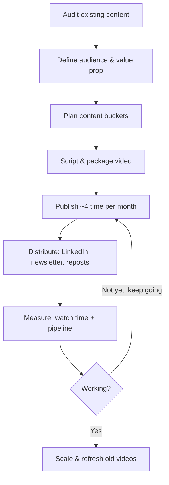

 # SOP: B2B SaaS YouTube Content Strategy

**Repository:** Project-B2B-SaaS-Youtube-Strategy\
**Based on:** 10 expert sources, 15 YouTube transcripts, and LinkedIn posts collected in `Research/`\
**Owner:** Animesh Dolas

> Every recommendation below is tagged with a source in the format: *(source: [Author], [link], [date])*. 

## 1. Objective 
 - This playbook is a practical Standard Operating Procedure (SOP) defines a repeatable process for launching, producing and growing YouTube channel as a lead-generation and authority-building channel for a B2B SaaS company. 
 - Unlike generic YouTube growth guides that optimize for views or subscribers, this playbook focuses on creating content that attracts high-intent buyers, builds long-term trust, and generates qualified sales opportunities
 
### The framework is built around 4 sequential phases:
    1.	Strategic Research & Ideation
    2.	Content Production & Optimization
    3.	Distribution & Amplification
    4.	Conversion & Revenue Generation

Throughout the playbook, recommendations are supported by expert sources. Where experts disagree, their perspectives are compared and evaluated to provide a reasoned recommendation rather than simply summarizing opinions.

## 2. Scope
This playbook covers:
- Customer research
- Topic validation
- SEO research
- Script planning
- Video production
- YouTube optimization
- LinkedIn distribution
- Influencer collaborations
- Lead generation
- Sales enablement
- Analytics
---
## 3. Overall Workflow (Continuous Improvement Loop)

---

## Phase 1: Research & Topic Selection
- Identify content opportunities that align customer demand with business objectives and have a high probability of generating qualified pipeline.

### *Step 1 — Identify Content-Market Fit*
- Before investing in production, verify that YouTube is an effective channel for your market.

#### Checklist
- [ ] **Confirm YouTube appears for buyer-intent searches.**
  - Foundation analyzed **8,000+ B2B SaaS keywords** and found YouTube appearing in:
    - **80%** of product demo searches
    - **22%** of "best [category]" searches
    - **20%** of "[brand] review" searches
    - **20%** of "[brand] vs [brand]" searches
  - *(**Source:** Ross Simmonds, LinkedIn, **17.06.2026**)*

- [ ] **Validate with independent research.**
  - Deliverable AI-friendly content outline.
  - Because AI search increasingly cites YouTube transcripts when answering detailed technical questions.
  - CASE STUDY 
      - Grizzle analyzed **3,623 videos across 71 SaaS channels** and found YouTube appearing in:
        - **74.9%** of SaaS keywords triggering Google AI Overviews
        - **75.1%** of bottom-of-funnel (BOFU) keywords with AI Overviews
  - *(**Source:** Tom Whatley, LinkedIn, ~**May 2026**)*

- [ ] **Estimate the real addressable audience.**
  - Don't compare B2B performance to consumer YouTube channels.
  - Hundreds of qualified ICP views often outperform thousands of irrelevant views.
  - If your ICP is extremely niche, prioritize videos for sales enablement (sales calls, follow-ups, website, onboarding) instead of relying solely on organic discovery.
  - *(**Source:** Samu Kovacs, LinkedIn, **23.06.2026**)*

### *Step 2 — Identify High-Potential Topics to attract qualified buyers.*

#### Checklist
- [ ] **Find Proven Content Patterns**
  - Use tools such as **VidIQ**, **10.com**, or similar platforms to identify "outlier" videos that achieved **3–7×** the channel's normal performance.
  - Reverse-engineer the framework (hook, angle, title, structure) instead of copying the topic directly.
  - Adapt the framework to your SaaS niche and ICP.
  - *(**Source:** Samu Kovacs, Watch me build a $100M B2B YouTube strategy in 12 minutes, **15.06.2026**)*

- [ ] **Focus on Urgent & Expensive Problems**
  - Choose topics that solve problems which are:
    - Recurring
    - High-value
    - Time-sensitive
    - Operationally messy
    - Experienced by a clearly defined buyer
  - Avoid creating videos around interesting but low-priority problems.
  - *(**Source:** TK Kader, The 7 SaaS Ideas I'd Build in 2026, **14.06.2026**)*

- [ ] **Create Information Gain** 
  - Google increasingly rewards original information rather than duplicated summaries.
  - **Success Criteria:** Every video contains at least one insight unavailable in competing videos.
  - Before writing the script:
      1. Search the target keyword.
      2. Review the highest-ranking videos and articles.
      3. List what existing content is missing.
      4. Add unique value such as:
        - Original frameworks
        - Customer stories
        - Proprietary data
        - Step-by-step implementation
        - Visual demonstrations
        - Practical examples
Every video should answer the question:
> **"Why should someone watch this instead of the current #1 result?"**\

**Source:** Tom Whatley, *How to create SEO content that ranks, fast*, **23.09.2024**

#### Phase 1 Output
- At the end of Phase 1, the team should have:
  - A validated Ideal Customer Profile
  - A prioritized list of customer problems
  - Original content angles
  - Evidence that topics match customer demand
  - Confidence that increased traffic will support business growth rather than amplify positioning issues

## Phase 2: 

